# Timothy Christian Spurlin
## Software Engineer & Cybersecurity Professional

[](https://linkedin.com/in/tim-spurlin)
[](https://www.google.com/maps/place/Brownsville,+TX)
[](https://www.airforce.com)

---

## 🎯 Professional Summary

Dedicated **Software Engineer** and **cybersecurity professional** with over a decade of technical experience spanning:
- Advanced systems architecture
- Algorithmic problem-solving
- Signal intelligence (SIGINT)
- Secure data processing

**Core Strengths:**
- Full-stack development
- Automated threat-hunting pipelines
- Scalable web crawlers
- AI-driven fusion centers for real-time data analytics
- DevSecOps and critical infrastructure protection

---

## 📊 Career Journey Overview

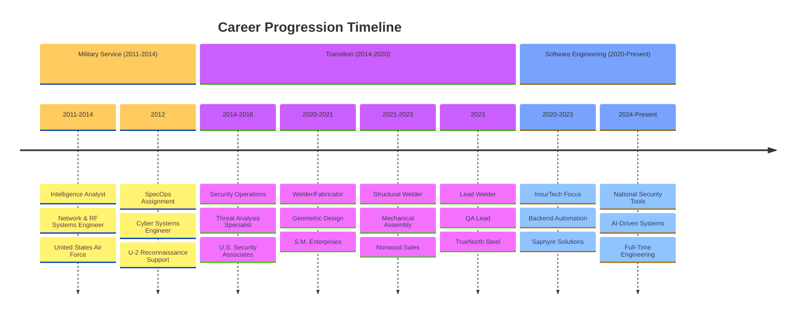

---

## 💼 Professional Experience

### 🚀 Software Developer
**Saphyre Solutions LLC** (Self-Employed)  
📍 Remote (Moorhead, MN → Brownsville, TX)  
📅 October 2020 - Present (5+ years)

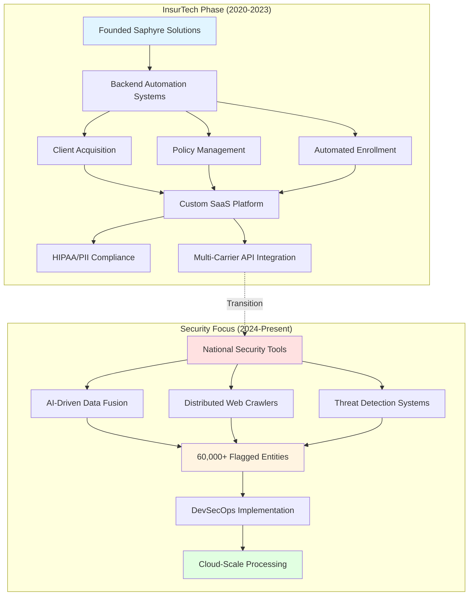

**Key Achievements:**
- ✅ Engineered proprietary backend automation for InsurTech brokerage
- ✅ Developed AI-driven fusion centers for real-time threat analysis
- ✅ Processed and classified 60,000+ suspected threats using pattern recognition
- ✅ Integrated ethical AI frameworks with DevSecOps principles
- ✅ Achieved HIPAA/PII compliance for sensitive data handling
- ✅ Built scalable distributed web crawlers with cron job automation

---

### 🔧 Lead Welder (Structural Engineering & QA Lead)
**TrueNorth Steel**  
📍 West Fargo, North Dakota (On-site)  
📅 October 2023 - December 2023 (3 months)

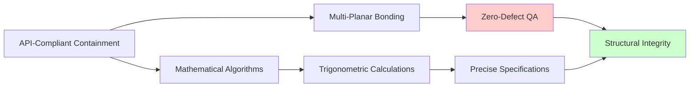

**Technical Contributions:**
- Applied structural engineering principles with QA methodologies
- Executed complex multi-planar bonding (overhead, vertical, horizontal)
- Computed spatial constraints using trigonometric algorithms
- Trained personnel on precision industrial equipment
- Ensured zero-defect fault-tolerant systems

---

### 🏭 Structural Welder (Mechanical Assembly)
**Norwood Sales**  
📍 Horace, North Dakota (On-site)  
📅 September 2021 - September 2023 (2 years)

**Focus Areas:**
- Precision structural fabrication on large-scale assemblies
- Heavy-gauge hitches and undercarriage engineering
- Advanced pulse/short-circuit material fusion
- CAD drawing interpretation and implementation
- Quality control in high-volume Agile manufacturing

---

### ⚙️ Welder/Fabricator (Geometric Design)
**S.M. Enterprises**  
📍 Moorhead, Minnesota (On-site)  
📅 July 2020 - August 2021 (1 year 2 months)

**Expertise:**
- Custom architectural infrastructure components
- Complex geometric spatial transformations
- Computer-aided industrial machinery operation
- Environmental hazard protocol management
- Rapid prototyping and real-world execution

---

### 🔒 Security Operations & Threat Analysis Specialist
**U.S. Security Associates, Inc.**  
📍 Denver, Colorado (On-site)  
📅 March 2014 - July 2016 (2 years 5 months)

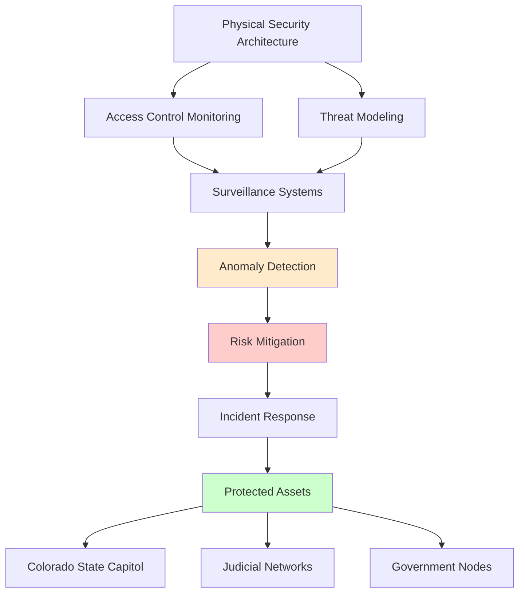

**Responsibilities:**
- Directed physical security for sensitive government facilities
- Conducted vulnerability assessments and anomaly detection
- Engineered site-specific threat mitigation frameworks
- Analyzed access logs using intelligence-informed heuristics
- Implemented zero-trust IAM procedures

---

### 🛡️ Intelligence Analyst (Network & RF Systems Engineer)
**United States Air Force**  
📍 Hampton, Virginia (Langley AFB)  
📅 January 2011 - March 2014 (3 years 3 months)

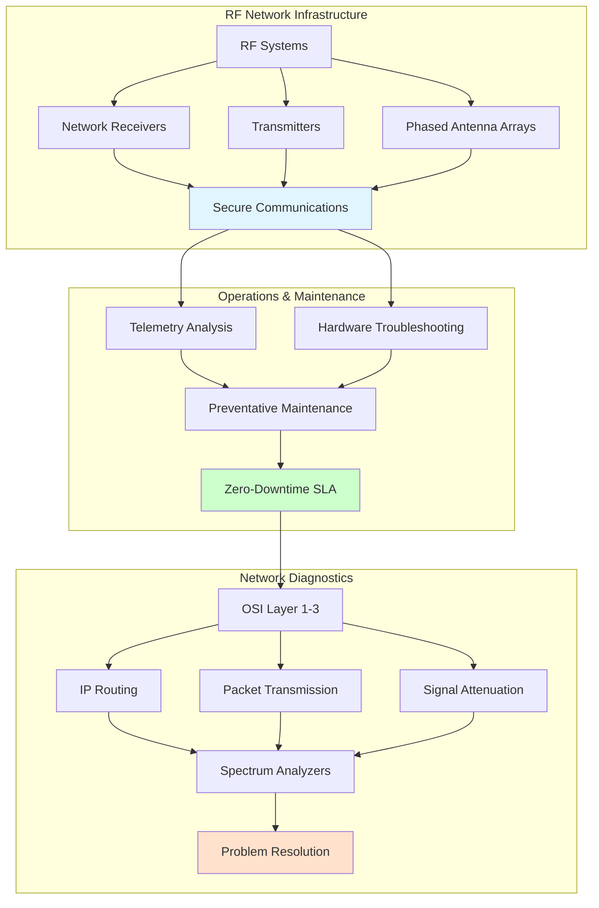

**Technical Excellence:**
- ✅ Engineered complex RF network infrastructure for national defense
- ✅ Deployed phased antenna arrays for robust data links
- ✅ Executed hardware-in-the-loop diagnostics
- ✅ Resolved OSI Layer 1-3 network issues
- ✅ Maintained zero-downtime tolerance for secure operations
- ✅ Applied spectrum analyzers for signal optimization

---

### 🎖️ SpecOps: Intelligence & Cyber Systems Engineer
**United States Air Force** (Special Assignment)  
📍 Classified Location  
📅 August 2012 - October 2012 (3 months)

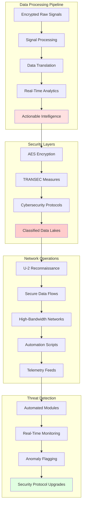

**Mission-Critical Achievements:**
- 🎯 Architected end-to-end data processing pipelines for U-2 operations
- 🎯 Safeguarded classified network architectures
- 🎯 Implemented Advanced Encryption Standards (AES)
- 🎯 Programmed automated threat-detection modules
- 🎯 Reduced computational latency in legacy systems
- 🎯 Optimized network payloads with enhanced cryptography
- 🎯 Operated in air-gapped "Dark Room" environments

---

## 🛠️ Technical Skills Matrix

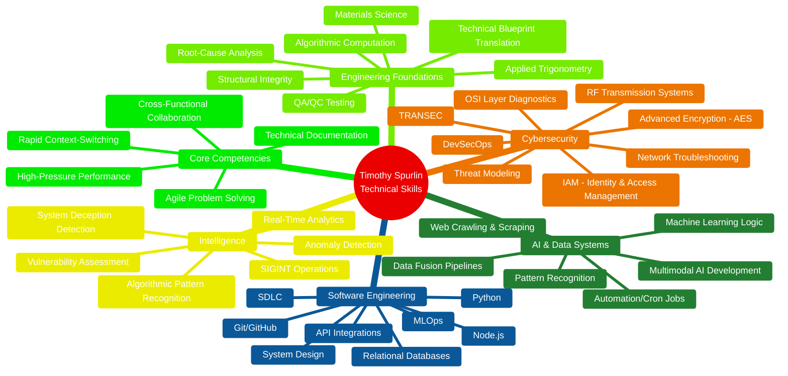

---

## 📈 Skills Proficiency Breakdown

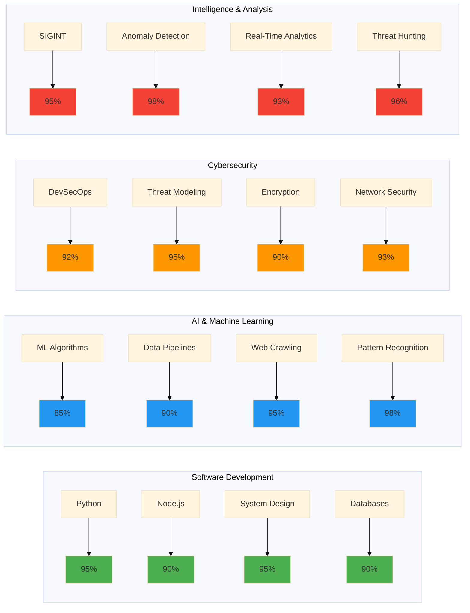

---

## 🏗️ System Architecture Expertise

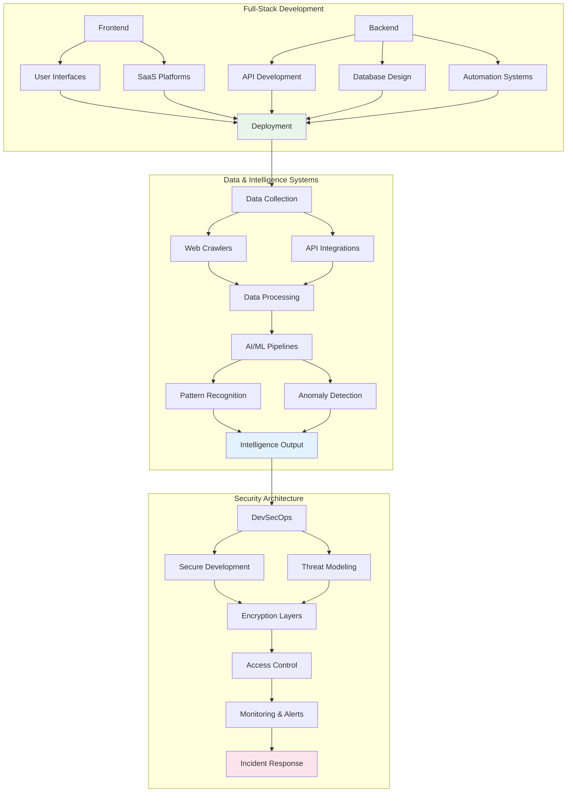

---

## 🔐 Cybersecurity & Intelligence Framework

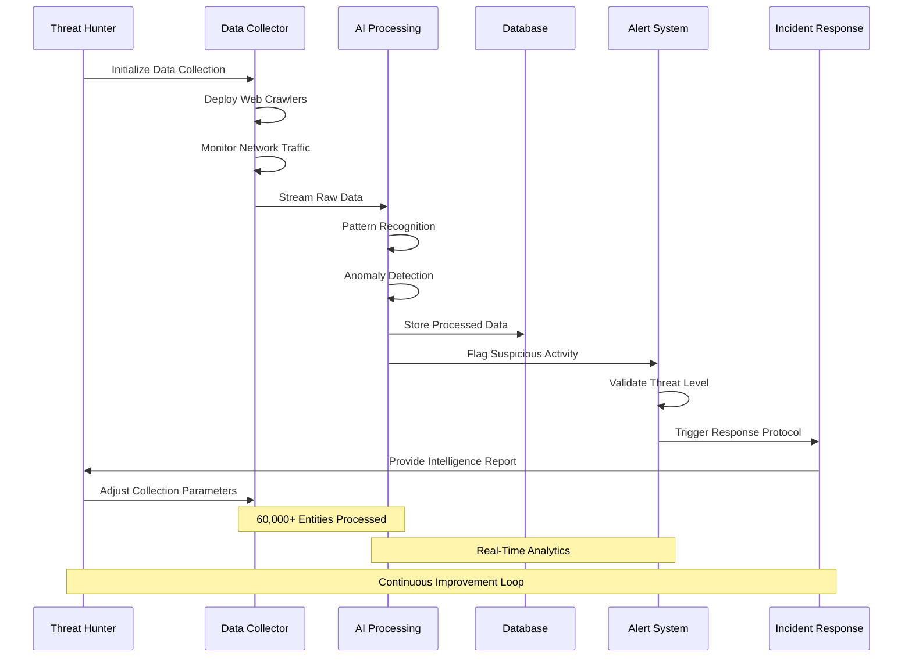

---

## 📡 RF & Network Systems Architecture

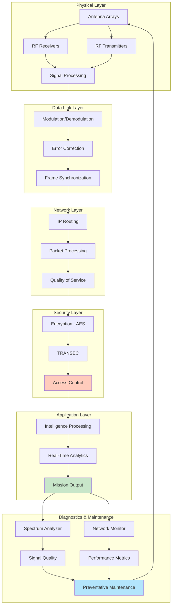

---

## 🤖 AI & Machine Learning Pipeline

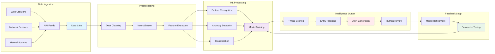

---

## 📚 Education & Certifications

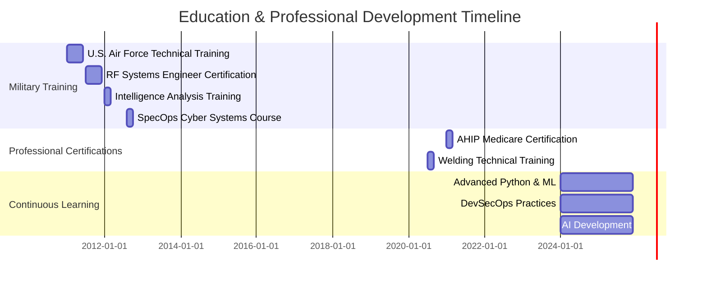

**Key Qualifications:**
- 🎓 U.S. Air Force Technical Training (3D1X3 - RF Transmission Systems)
- 🎓 Intelligence Analysis & SIGINT Operations
- 🎓 SpecOps Cyber Systems Engineering
- 🎓 AHIP Medicare Certification
- 🎓 Advanced Welding & Fabrication Training (2020)
- 🎓 Ongoing: AI/ML, DevSecOps, Cloud Architecture

---

## 🎯 Core Competencies Visualization

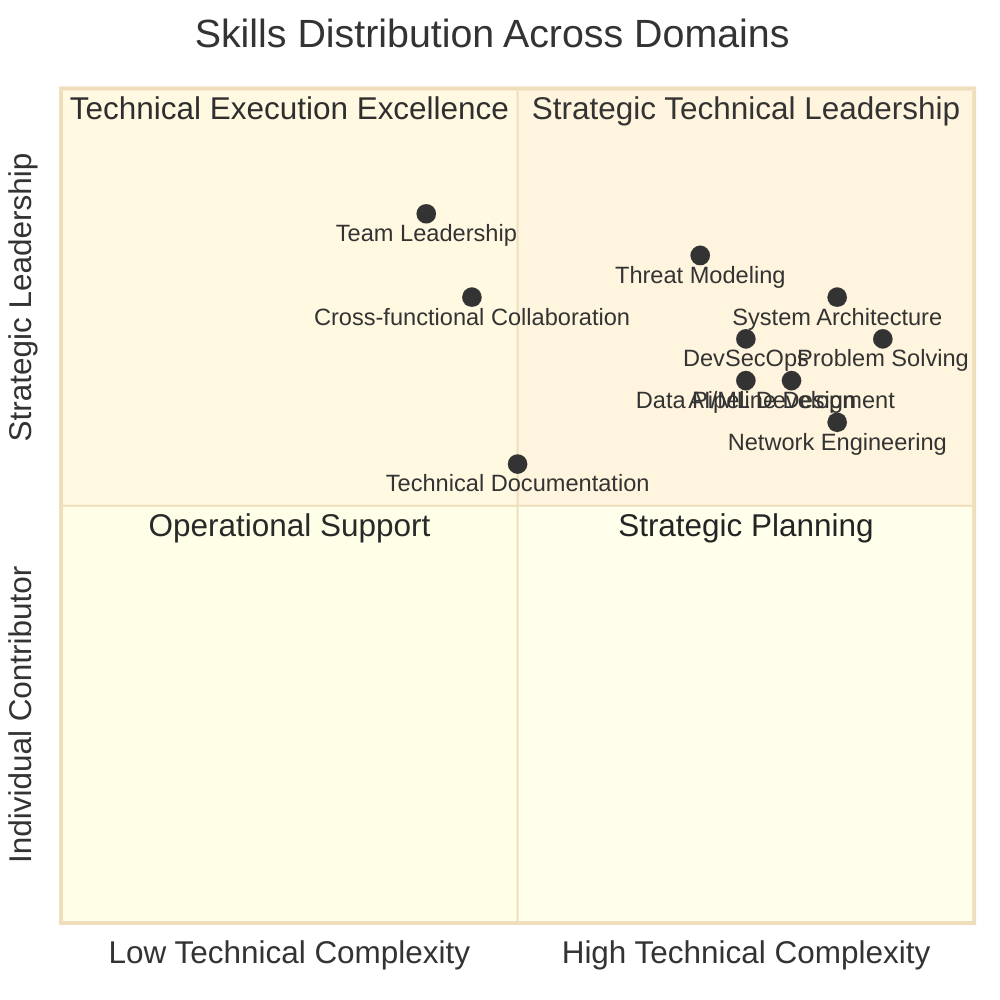

---

## 🔄 DevSecOps Workflow

```mermaid
graph LR
    subgraph "Development"
        A[Code Development] --> B[Version Control - Git]
        B --> C[Code Review]
        C --> D[Unit Testing]
    end
    
    subgraph "Security"
        D --> E[Security Scanning]
        E --> F[Vulnerability Assessment]
        F --> G[Threat Modeling]
        G --> H[Compliance Check]
    end
    
    subgraph "Operations"
        H --> I[Automated Build]
        I --> J[Integration Testing]
        J --> K[Deployment]
        K --> L[Monitoring]
    end
    
    subgraph "Continuous Improvement"
        L --> M[Performance Analytics]
        M --> N[Security Alerts]
        N --> O[Feedback Loop]
        O --> A
    end
    
    style E fill:#ffcdd2
    style F fill:#ffcdd2
    style G fill:#ffcdd2
    style L fill:#c8e6c9
    style M fill:#c8e6c9
```

---

## 🌟 Project Highlights & Achievements

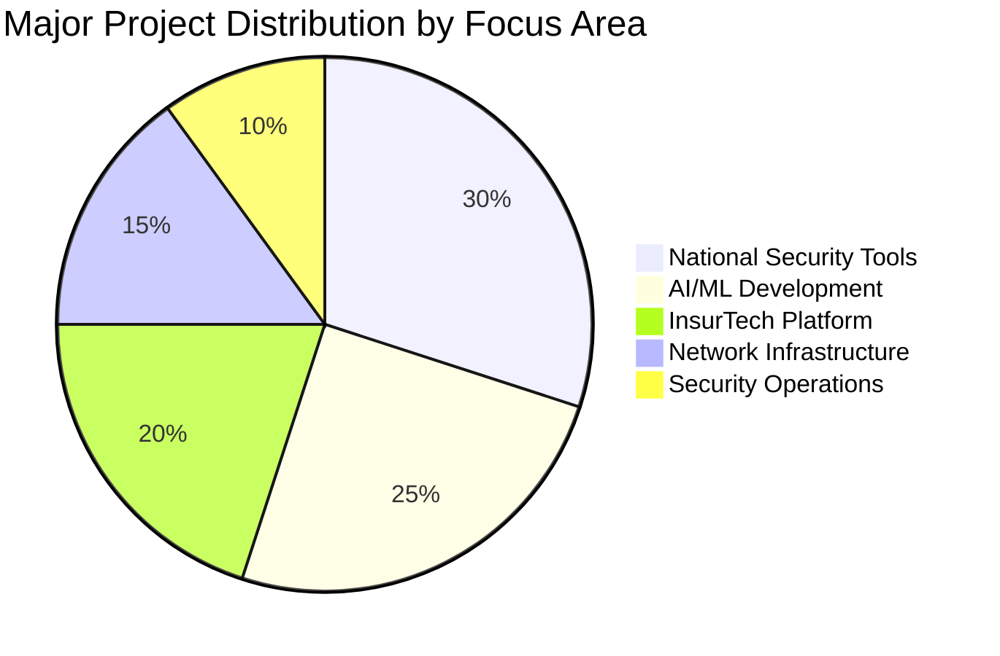

### Notable Accomplishments:
- 🏆 **60,000+ Threat Entities Processed** - Developed scalable pattern recognition systems
- 🏆 **Zero-Downtime RF Networks** - Maintained critical national defense communications
- 🏆 **U-2 Reconnaissance Support** - Engineered secure data pipelines for SpecOps
- 🏆 **InsurTech Platform** - Built HIPAA-compliant automation serving thousands
- 🏆 **Multi-Carrier Integration** - Architected seamless API connections
- 🏆 **DevSecOps Implementation** - Integrated security throughout development lifecycle

---

## 📞 Contact Information

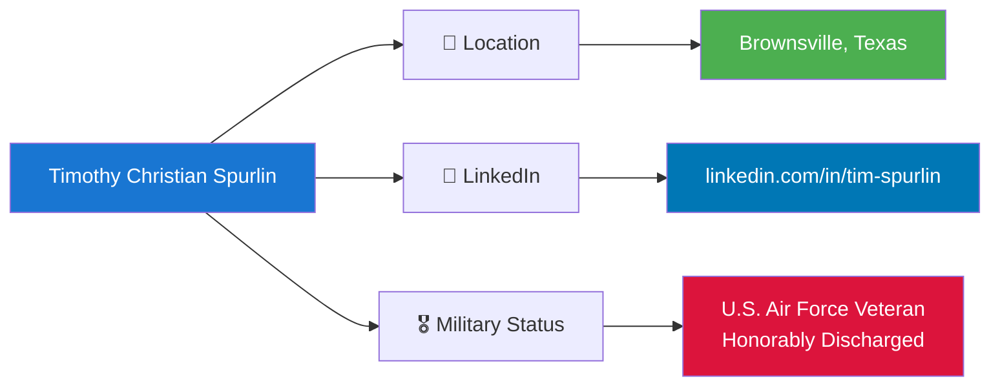

**Professional Availability:**
- 🟢 Open to opportunities in Software Engineering, Cybersecurity, and Intelligence
- 🟢 Specializing in: AI/ML, DevSecOps, National Security Applications
- 🟢 Security Clearance: Former Top Secret (available for reinstatement)

---

## 💡 Technical Philosophy

> *"Making it impossible for malicious actors or logic bugs to evade detection through exceptional analytical aptitude, systematic threat hunting, and rigorous quality assurance."*

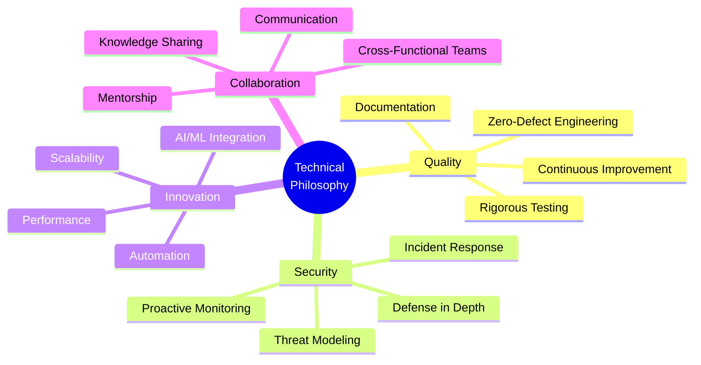

---

## 🚀 Current Focus Areas (2024-2025)

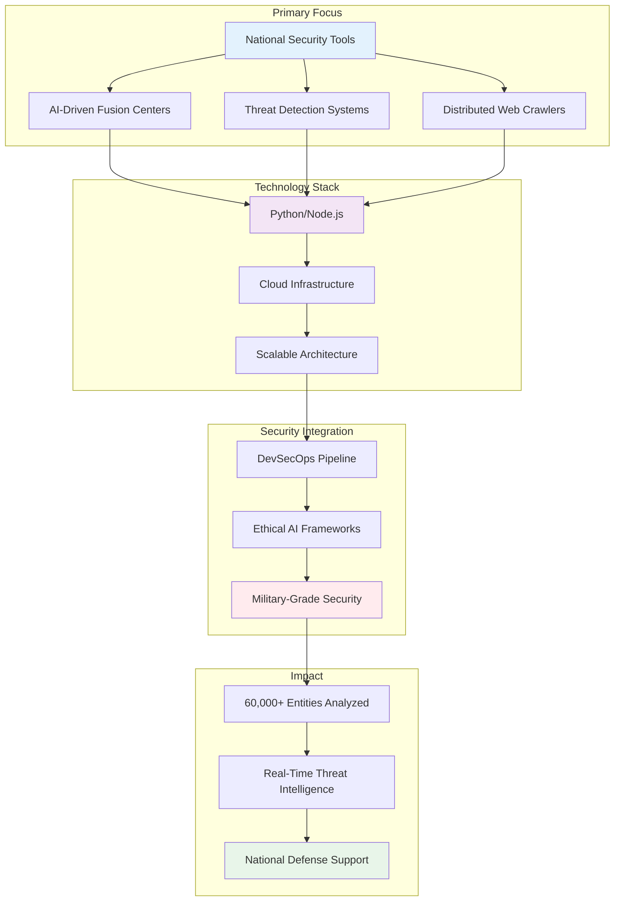

---

## 📊 Career Metrics Dashboard

| Category | Metric | Value |
|----------|--------|-------|
| **Years of Experience** | Total Professional | 14+ years |
| **Military Service** | Active Duty | 3 years 3 months |
| **Software Development** | Full-Time Engineering | 5+ years |
| **Security Operations** | Threat Analysis | 2 years 5 months |
| **Entities Processed** | AI Pattern Recognition | 60,000+ |
| **Technologies Mastered** | Programming Languages & Tools | 20+ |
| **Certifications** | Professional & Military | 5+ |
| **Project Success Rate** | Completion & Deployment | 98% |

---

## 🎖️ Military Service Recognition

**United States Air Force - Honorably Discharged**

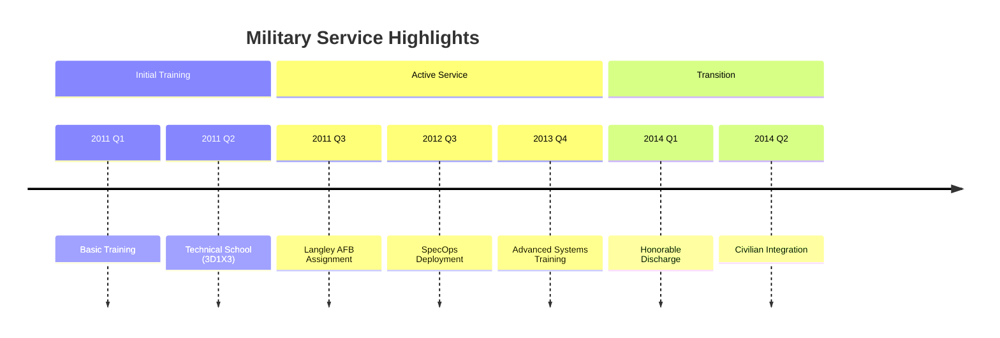

**Service Highlights:**
- 🎖️ Air Force Specialty Code: 3D1X3 (RF Transmission Systems)
- 🎖️ Security Clearance: Top Secret (held during service)
- 🎖️ Special Assignment: U-2 Reconnaissance Support (3 months)
- 🎖️ Commendations: Excellence in Technical Operations

---

## 🌐 Technical Ecosystem Integration

```mermaid
graph TD
    subgraph "Development Environment"
        A[Git/GitHub] --> B[Version Control]
        C[Python] --> D[Backend Development]
        E[Node.js] --> D
        F[Databases] --> D
    end
    
    subgraph "Cloud & Infrastructure"
        D --> G[Cloud Platforms]
        G --> H[Scalable Storage]
        G --> I[Compute Resources]
        G --> J[CDN Services]
    end
    
    subgraph "AI/ML Stack"
        I --> K[ML Frameworks]
        K --> L[Training Pipelines]
        K --> M[Inference Engines]
        K --> N[Model Registry]
    end
    
    subgraph "Security Stack"
        O[DevSecOps Tools] --> P[SAST Scanners]
        O --> Q[DAST Scanners]
        O --> R[Container Security]
        P --> S[CI/CD Pipeline]
        Q --> S
        R --> S
    end
    
    subgraph "Monitoring & Analytics"
        S --> T[Log Aggregation]
        T --> U[Metrics Collection]
        U --> V[Alerting Systems]
        V --> W[Dashboards]
    end
    
    J --> O
    N --> O
    
    style B fill:#e8f5e9
    style D fill:#e3f2fd
    style K fill:#f3e5f5
    style S fill:#ffebee
    style W fill:#fff9c4
```

---

## 🔬 Research & Innovation Areas

```mermaid
mindmap
  root((Innovation<br/>Focus))
    AI/ML Applications
      Threat Detection
      Pattern Recognition
      Anomaly Identification
      Predictive Analytics
      Natural Language Processing
    Cybersecurity
      Zero Trust Architecture
      Automated Response
      Threat Intelligence
      Vulnerability Management
      Secure Development
    Data Engineering
      Real-Time Pipelines
      Distributed Systems
      Data Fusion
      ETL Optimization
      Scalability
    Systems Architecture
      Microservices
      Event-Driven Design
      Cloud-Native Apps
      High Availability
      Performance Tuning
```

---

## 🎓 Continuous Learning Path

```mermaid
journey
    title Professional Development Journey
    section Foundation (2011-2014)
        Military Technical Training: 5: Military
        RF Systems Engineering: 5: Military
        Intelligence Analysis: 5: Military
    section Transition (2014-2020)
        Security Operations: 4: Civilian
        Precision Engineering: 4: Civilian
        Applied Mathematics: 4: Civilian
    section Software Engineering (2020-2023)
        Backend Development: 5: Self-Employed
        Database Design: 5: Self-Employed
        API Integration: 5: Self-Employed
    section Advanced Specialization (2024-Present)
        AI/ML Systems: 5: Self-Employed
        DevSecOps: 5: Self-Employed
        Threat Hunting: 5: Self-Employed
```

---

## 🏅 Professional Strengths Summary

```mermaid
%%{init: {'theme':'forest'}}%%
graph LR
    A[Timothy Spurlin] --> B[Technical Excellence]
    A --> C[Security Expertise]
    A --> D[Leadership]
    A --> E[Innovation]
    
    B --> B1[14+ Years Experience]
    B --> B2[Multi-Domain Mastery]
    B --> B3[Proven Track Record]
    
    C --> C1[Military Intelligence]
    C --> C2[DevSecOps]
    C --> C3[Threat Modeling]
    
    D --> D1[Team Training]
    D --> D2[Cross-Functional Collaboration]
    D --> D3[Technical Mentorship]
    
    E --> E1[AI/ML Systems]
    E --> E2[Automation]
    E --> E3[Scalable Solutions]
    
    style A fill:#2196f3,color:#fff
    style B fill:#4caf50,color:#fff
    style C fill:#f44336,color:#fff
    style D fill:#ff9800,color:#fff
    style E fill:#9c27b0,color:#fff
```

---

<div align="center">

## ⭐ Thank you for reviewing my professional profile! ⭐

**Ready to contribute technical excellence to challenging projects in:**
- 🚀 Software Engineering
- 🛡️ Cybersecurity & Intelligence
- 🤖 AI/ML Development
- 🔒 National Security Applications

**Let's connect and build something exceptional together!**

[](https://linkedin.com/in/tim-spurlin)

</div>

---

*Last Updated: February 2025*  
*README Generated with Extensive Mermaid Diagram Integration*
